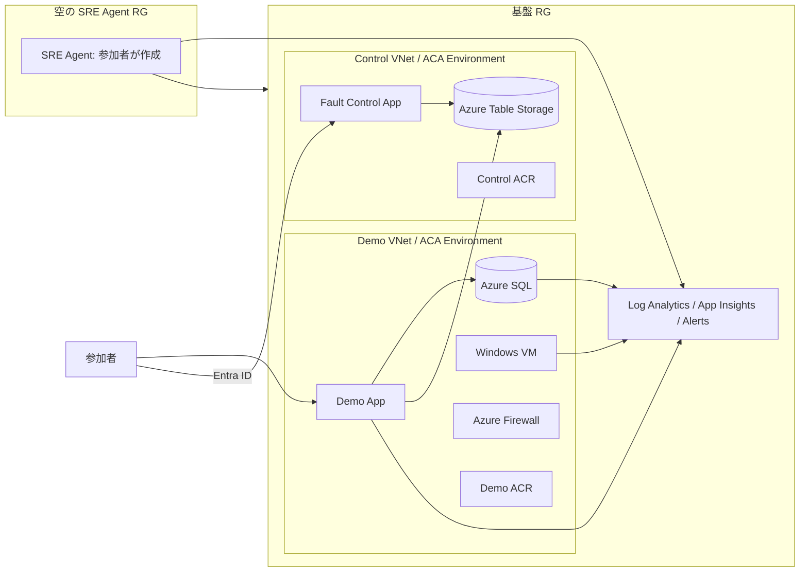

# Azure SRE Agent Demo

Azure SRE Agent の作成、監視接続、障害検知、調査、復旧を体験するハンズオン環境です。主催者がアプリ基盤と空の Agent 用リソースグループを構築し、参加者が [Azure SRE Agent](https://sre.azure.com/) を作成して演習します。

> [!WARNING]
> Fault は明示的に停止、緊急停止、またはリセットするまで継続します。本番環境では使用しないでください。

## 現在の実装状況

全Faultの実装はありますが、Azure実環境での作用と復旧は未検証です。

| 範囲 | 状況 |
|---|---|
| Demo AppのCRUD、バックグラウンドREAD/WRITEワークロード、操作イベント記録 | 実装済み |
| Control Appの集計グラフ、認証・認可、監査、Fault状態管理 | 実装済み |
| アプリFault: 例外、遅延、N+1 | 実装済み |
| VM Fault: CPU、メモリ、F:ディスク | Runner実装済み、Azure実デプロイ未検証 |
| SQL Fault: 高負荷、デッドロック | Runner実装済み、Azure実デプロイ未検証 |
| Network Deny | 専用Firewall RCGとRunner実装済み、Azure実デプロイ未検証 |
| Reconciler | 1分周期Jobを実装済み、Azure実デプロイ未検証 |
| 同一基盤RG内のDemo/Control分離と空のAgent RG | Bicepとスクリプト実装済み、Azure実デプロイ未検証 |
| 指定パブリックIPv4だけに許可するDemo ACA公開 | Bicepとスクリプト実装済み、Azure実デプロイ未検証 |

Azure Fault 6種は、対象サブスクリプションで開始、観測、停止、復旧を確認してから演習に使用してください。
バックグラウンドワークロードは監視データ生成用に継続実行します。Faultの開始・停止は自動化せず、Control Appからの明示操作だけで行います。

## アーキテクチャ

基盤リソースグループは1つですが、障害対象の Demo 系と障害操作用の Control 系は、VNet、Container Apps Environment、ACR、Managed Identity を分離します。リソースグループは管理・RBAC・削除の単位であり、Network Fault の障害境界はネットワーク経路と実行環境の分離で確保します。SRE Agent 用リソースグループだけを別に作成します。



Control VNet は Demo のHub/Spoke VNetとピアリングせず、Demo側のFirewallとUDRを使用しません。両アプリは専用ACRからManaged Identityでイメージを取得します。操作イベント、Fault状態、監査ログは障害対象SQLではなくAzure Table Storageへ保存します。

Demo Appは既定で内部ACAに配置されるため、BastionでVMへ接続し、VM内のブラウザから操作します。デプロイ時に単一のパブリックIPv4アドレスを指定した場合だけACAを公開し、そのアドレスの`/32`から直接アクセスできます。Control Appは常にインターネット公開され、Entra IDで保護されます。

## デプロイ内容

### 基盤 RG: `rg-sre-demo`

- Demo App、Demo Container Apps Environment、Demo ACR、Demo Managed Identity
- Hub/Spoke VNet、Azure Firewall、Bastion、Windows VM
- Azure SQL DatabaseとPrivate Endpoint
- VM Fault専用4 GiB Standard SSD E1（`F:`、`SREFAULT`）
- Fault Control App、Control Container Apps Environment、Control VNet、Control ACR、Control Managed Identity
- Azure Table Storage: `ActivityEvents`、`FaultState`、`AuditLog`
- Log Analytics、Application Insights、Data Collection Rule、Action Group、Alert Rules

### Agent RG: `rg-sre-agent`

デプロイ直後は空です。SRE Agent本体は主催者のスクリプトでは作成せず、参加者が演習中に作成します。

## 前提条件

- PowerShell 7
- Azure CLIとBicep CLI（`az bicep install`）
- Azure CLIのContainer Apps拡張
- Git
- 対象サブスクリプションでリソースとロール割り当てを作成できる権限
- Control App用の単一テナントMicrosoft Entraアプリ登録とクライアントID
- `Microsoft.App`など、テンプレートが使用するAzureリソースプロバイダーの登録
- SRE Agent対応リージョンと、ブラウザから必要なAzure/SRE Agentエンドポイントへの通信

GitHub Actions OIDCを設定する場合だけGitHub CLIも必要です。

## 主催者のデプロイ

1. Azureへサインインし、対象サブスクリプションを選択します。

```powershell
az login
az account set --subscription '<subscription-id>'
```

2. 必須環境変数を設定します。秘密値をファイルへ保存しないでください。

```powershell
$env:SRE_ADMIN_USERNAME = 'azureadmin' # 省略可
$env:SRE_ADMIN_PASSWORD = '<VM-password>'
$env:SRE_SQL_PASSWORD = '<SQL-password>'
$env:SRE_NOTIFICATION_EMAIL = '<alert-email>'
$env:SRE_CONTROL_ENTRA_CLIENT_ID = '<control-app-client-id>'
```

3. 一括デプロイを実行します。

```powershell
./scripts/deploy.ps1

# 名前やリージョンを変更する場合
./scripts/deploy.ps1 `
  -ResourceGroup 'rg-my-sre-demo' `
  -Location 'japaneast' `
  -SreAgentResourceGroup 'rg-my-sre-agent' `
  -SreAgentLocation 'eastus2'

# 手元PCのパブリックIPv4からDemo Appへ直接アクセスする場合
./scripts/deploy.ps1 -DemoAllowedSourceIp '<your-public-ipv4>'
```

`-DemoAllowedSourceIp`にはCIDRを付けず、単一のパブリックIPv4アドレスを指定します。スクリプトがACA Ingressへ`<address>/32`のAllowルールを設定し、それ以外の送信元を拒否します。省略時はインターネット公開せず、Bastion/VNet経由で操作します。

Container Apps Environmentの内部／公開モードは作成後に変更できません。既存環境のモードと指定内容が異なる場合、スクリプトは変更前に停止します。対象がDemo環境であることを確認し、次の順でDemo AppとEnvironmentを削除してから再実行してください。SQL、VM、Control Appは削除されません。

```powershell
az containerapp delete --name sre-demo-app --resource-group '<infrastructure-rg>' --yes
az containerapp env delete --name sre-demo-cae --resource-group '<infrastructure-rg>' --yes
./scripts/deploy.ps1 -ResourceGroup '<infrastructure-rg>' -DemoAllowedSourceIp '<your-public-ipv4>'
```

スクリプトは次の順に実行します。

1. 基盤RGと空のAgent RGを作成
2. Demo用Log Analyticsを先行作成
3. Controlテンプレートを基盤RGへデプロイ
4. Control Storageの出力を渡してDemoテンプレートを同じ基盤RGへデプロイ
5. Control AppとDemo Appを各専用ACRでビルド
6. Container AppとJobをコミットハッシュ＋デプロイ時刻タグのイメージへ更新

完了時にDemo URL、Control URL、2つのRG、監視リソースID、Fault Environment IDを表示します。再実行も同じRG名とプレフィックスを使用してください。

GitHub Actions OIDCをDemo ACR/Appへ設定する場合:

```powershell
./scripts/deploy.ps1 -EnableOidc -GitHubRepo 'owner/repository'
```

## 参加者の手順

1. `https://sre.azure.com/`を開き、指定されたAgent RGにSRE Agentを作成します。
2. 基盤RGをAzureスコープとして接続します。
3. `sre-demo-law`と`sre-demo-appi`を監視コンテキストへ追加します。
4. `knowledge/`のファイルをKnowledge Sourceへ登録します。
5. `infra/prompts/incident-auto.md`または`incident-review.md`を使ってインシデント応答プランを設定します。
6. Demo Appで正常状態を確認し、Control Appから指定されたFaultを開始します。
7. アラート、Agentの調査、復旧操作、成功率の回復を確認します。
8. 演習終了時にすべてのFaultを停止またはリセットします。

Agent作成と接続には、Agent RGと基盤RGへ必要なRBACが必要です。権限はRGスコープに限定し、可能ならPIMで演習時間だけ有効化してください。

## アプリの使い方

### Demo App

サンプル業務画面です。Itemsの一覧、追加、Status更新、削除、再読込を操作できます。バックグラウンドでは監視データ生成用のREAD/WRITEワークロードが継続し、操作イベント上は`AUTO`、ユーザー操作は`USER`として記録されます。

主なAPI:

| API | 用途 |
|---|---|
| `GET /health` | プロセスのヘルスチェック |
| `GET /ready` | SQL接続を含むレディネス確認 |
| `GET /api/items` | Items取得 |
| `POST /api/items` | Item追加 |
| `PUT /api/items/:id` | Item更新 |
| `DELETE /api/items/:id` | Item削除 |

### Fault Control App

Microsoft Entra IDで認証して使用します。期間、操作元、操作種別で絞り込み、時間バケットごとの成功／失敗件数と成功率を確認できます。Fault一覧にはdesired state、observed state、開始時刻、最終確認時刻が表示されます。

- Reader: DashboardとFault状態を閲覧
- Operator: Faultの開始、停止、緊急停止、リセット
- 状態確認時刻が古い場合: 実状態を断定せず「状態確認不能」として扱う

## Faultカタログ

| Fault ID | 対象 | 内容 | 主な観測 |
|---|---|---|---|
| `app-exception` | Application | Items取得で例外 | 5xx、例外、失敗率増加 |
| `app-latency` | Application | API応答遅延 | 応答時間増加 |
| `app-n-plus-one` | Application/SQL | N+1クエリ | SQL依存呼出し、遅延 |
| `vm-cpu-high` | VM | CPU高負荷 | CPUアラート |
| `vm-memory-high` | VM | メモリ高負荷 | Committed Bytesアラート |
| `vm-disk-pressure` | VM | Fault専用F:ディスクひっ迫 | F:空き容量アラート |
| `sql-high-load` | SQL | SQLワーカー高負荷 | workers percentアラート |
| `sql-deadlock` | SQL | 2セッションのデッドロック | SQLエラー、失敗増加 |
| `network-deny` | Network | Demo通信のDeny | 接続失敗、依存関係失敗 |

アプリ内3 FaultはDemo AppのFault Adapterが反映します。AzureリソースFaultはDemo ACA Environment内の専用Runnerが反映し、1分周期のReconcilerが遷移タイムアウトを検出します。Runnerをデプロイしていない場合はdesired stateだけが更新され、observed stateはactiveになりません。

FaultにTTLや自動停止はありません。停止、緊急停止、またはリセットを必ず実行してください。クライアントから任意コマンド、任意SQL、任意パス、任意Resource IDは指定できません。

VMディスクFaultは`F:\SreFault\disk-pressure.bin`だけを使用し、`C:`と`D:`を操作しません。空き8%を目標とし、256 MiBを絶対下限として残します。

Network Denyは`SreFaultRuleCollectionGroup`だけを更新し、Spoke2 (`10.3.0.0/16`) からSpoke1 (`10.2.0.0/16`) への通信を遮断します。Control VNetは対象に含みません。SQL Faultは固定クエリだけを実行し、Demo Appが作成する専用低権限ユーザーの接続文字列をContainer Apps secretとしてRunnerへ渡します。

## 監視とアラート

| 対象 | 条件の概要 |
|---|---|
| Application | 例外、失敗要求、遅い応答 |
| VM CPU | CPU使用率高騰 |
| VM Memory | `\Memory\% Committed Bytes In Use`が80%超 |
| VM Disk | `\LogicalDisk(F:)\% Free Space`低下 |
| VM Heartbeat | Heartbeat欠落 |
| Azure SQL | DTU/CPU、接続、`workers_percent`が60%超 |
| Container Apps | CPUまたはMemoryが80%超 |

VMログとPerfはAzure Monitor AgentとDCRでLog Analyticsへ、アプリテレメトリはApplication Insightsへ送信します。通知先は`SRE_NOTIFICATION_EMAIL`です。

## 安全上の制約

- 本番環境へのデプロイは禁止です。
- DemoとControlは同じRGでもVNet、ACA Environment、ACR、Identityを分離します。
- Control VNetはDemoのFirewall、UDR、Private DNSへ依存しません。
- Shared Keyを無効化し、StorageアクセスはManaged IdentityとTable単位RBACを使用します。
- Demo IdentityにVM、SQL、Firewallを変更する管理プレーン権限を付与しません。
- Control APIは固定Faultカタログだけを受け付け、操作をAuditLogへ記録します。
- Fault停止後はobserved stateと実リソースの回復を確認します。

## トラブルシューティング

| 症状 | 確認事項 |
|---|---|
| デプロイ前に停止する | 必須環境変数、`az login`、選択中サブスクリプション、Control Entra Client ID |
| Bicepデプロイが失敗する | Resource Provider、リージョンのSKU/Quota、ポリシー、デプロイOperation |
| Control Appが401/403 | App Registrationのissuer/audience、組み込み認証、Reader/Operator role claim |
| Dashboardにデータがない | Demo IdentityのTable RBAC、両VNetのTable Private Endpoint/DNS、AUTOワークロード |
| Faultが状態確認不能 | `lastHeartbeatAt`、Demo AppまたはRunnerのログ、Storage到達性、generation不一致 |
| アラートが発火しない | DCR association、Perf/Eventテーブル、評価期間、Action Group、対象ディメンション |
| Faultを停止できない | 緊急停止を要求し、Runner/Reconciler、対象プロセス、Firewall専用ルールを確認 |

`az deployment group show`とContainer AppのSystem/Consoleログで、失敗した段階とManaged Identity/RBACエラーを確認してください。

## クリーンアップ

最初にControl Appで緊急停止またはリセットを実行し、すべてのFaultがinactiveであることを確認します。その後、既定では基盤RGとAgent RGの両方を削除します。

```powershell
./scripts/destroy.ps1

# RG名を変更した場合
./scripts/destroy.ps1 `
  -ResourceGroup 'rg-my-sre-demo' `
  -SreAgentResourceGroup 'rg-my-sre-agent'

# Agent RGを保持する場合
./scripts/destroy.ps1 -KeepSreAgent
```

`-NoConfirm`は確認なしで削除を開始します。SRE Agentの継続課金を避けるため、保持が必要な場合以外はAgent RGも削除してください。

`-EnableOidc`で作成または再利用したEntraアプリ`sre-demo-github-actions`は、RG削除の対象外です。不要になった場合は、他の環境やリポジトリで使用していないことを確認してからEntra ID側で削除してください。

## リポジトリ構成

| パス | 内容 |
|---|---|
| `app/` | Demo App、AUTOワークロード、Activity Writer、アプリ内Fault Adapter |
| `control-app/` | Dashboard、Fault API、認可、監査、固定Faultカタログ |
| `fault-runner/` | Azure Fault 6種の固定executor、状態更新、Reconciler |
| `infra/main.bicep` | Demo系Hub/Spoke、SQL、VM、監視、Demo App |
| `infra/control-main.bicep` | Control VNet、Storage、Control ACR/ACA、Control App |
| `infra/modules/` | 各AzureリソースのBicepモジュール |
| `infra/prompts/` | SRE Agentの応答プランとタスク用プロンプト |
| `knowledge/` | Agentへ登録するアプリ、DB、ネットワーク、基盤の知識 |
| `scripts/deploy.ps1` | 2 RG作成、Control先行、Demo後続、アプリとFault実行系のデプロイ |
| `scripts/destroy.ps1` | 基盤RGとAgent RGの削除 |

## ローカルテスト

```powershell
Push-Location app
npm install
npm test
Pop-Location

Push-Location control-app
npm install
npm test
Pop-Location

Push-Location fault-runner
npm install
npm test
Pop-Location
```